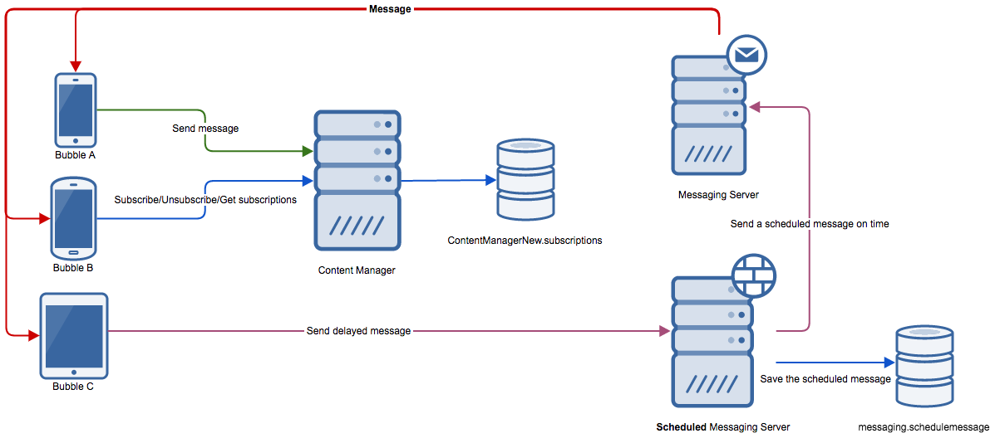

#Soda Platform API Wrapper (Alpha)
Exposes a single class which manages all communication against the ContentManger.

It simply wraps all the APIs described [here](https://startapp.atlassian.net/wiki/display/SDKSOC/S2S+Services)



##Usage example

```javascript
let ContentManager = require('sodaplatform-wrapper').ContentManager;

let contentManager = new ContentManager('https://content.startappnetwork.com/content-manager/', 'YourBubbleId'');

//Now call any class method, e.g. contentManager.subscribe(...)
```